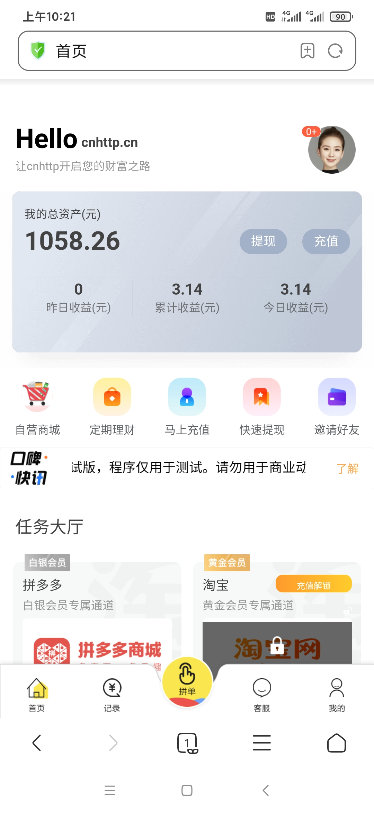
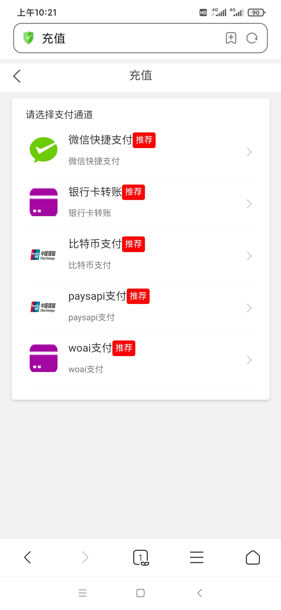
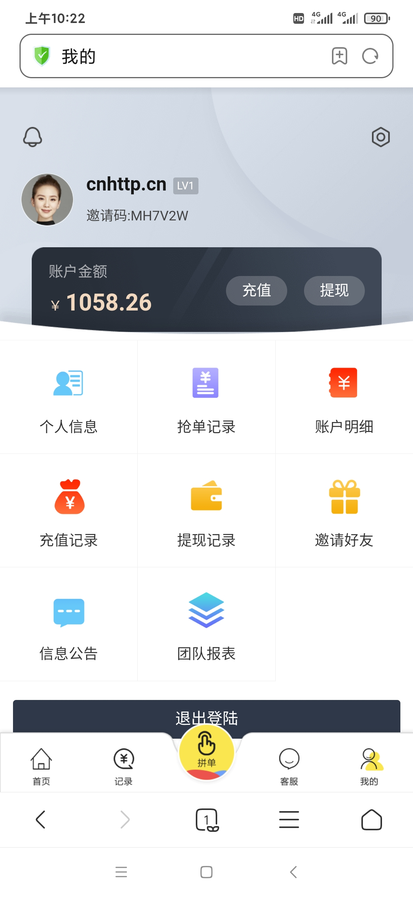
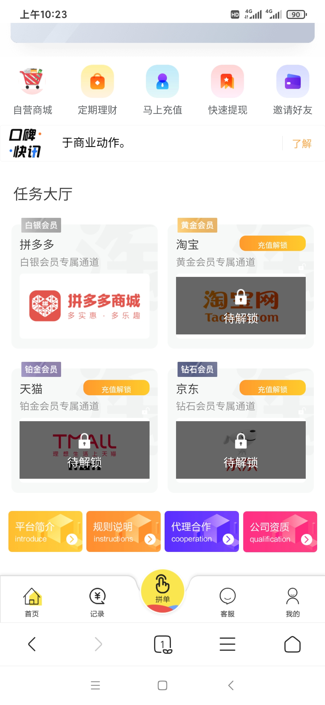
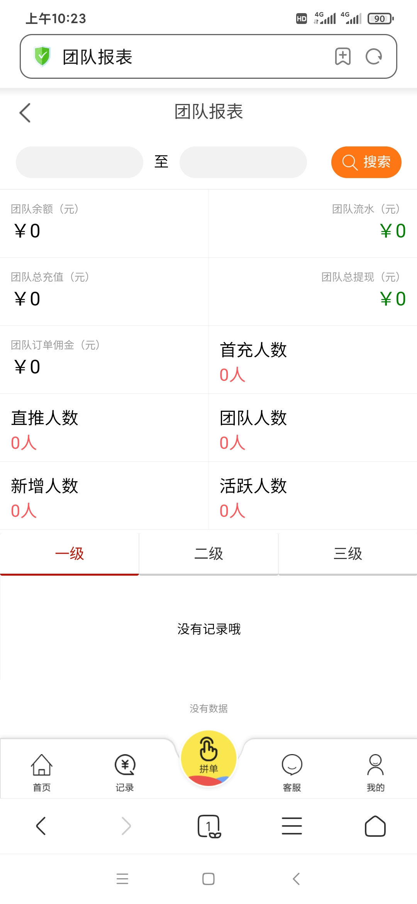
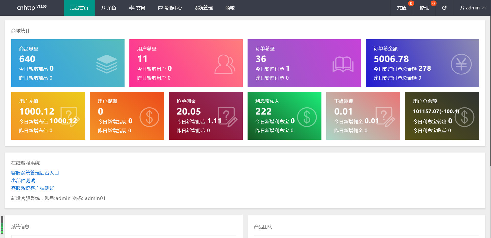
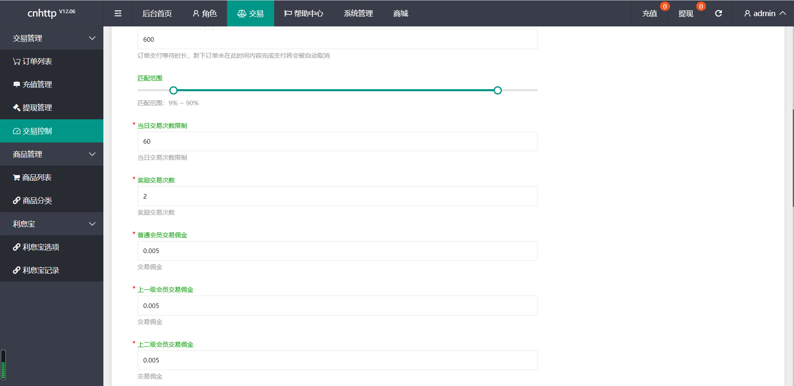
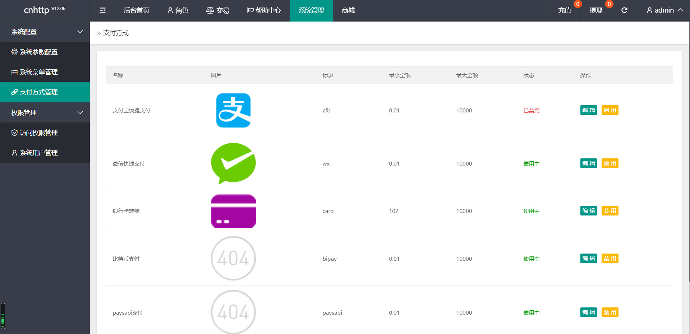

# 商城 V12.06 自动抢单 理财 返利 佣金 升息 区块链支付

测试账号：13800000001
测试密码：000000

升级日志：
（Ver 12.06）
1：冗余的js以及Css，流畅度和体验性更好。

2：修复老版本不合理的逻辑处理以及众多bug。

3：增强主流浏览器兼容性。

3：修复多处存在sql注入的漏洞，安全完美运营。

4：移除几处base64编码后门。

功能列表：
1：本系统采用tp5.1.38，也就是最新的tp架构，稳定，流畅，无任何漏洞，运营无忧。

2：自动抢单。

3：利息宝。

4：推广佣金制度自定义。

5：会员等级。

6：权限自定义。

7：可对接三方支付。

8：盈利简单粗暴。

## Screenshots

亲爱的各位买家朋友，懂源码就直接购买；
1. 在使用本系统时，使用方必须在国家相关法律法规范围内并经过国家相关部门的授权许可，禁止用于一切非法行为。
2. 本系统的使用用途仅限于测试、实验、研究为目的，禁止用于一切商业运营，本团队不承担使用者在使用过程中的任何违法行为负责。
3. 源码以演示站为准。

注：
1、请勿以无法对接或者其他相关问题退款，本店所有技术服务均为收费费用；
2、商品设置的安装调试只是单网站运行环境配置，不包含其它任何相关配置；
3、如源码存在问题可以购买的技术服务；本店承接数字资产相关服务；
4、网站相关接口均为收费配置；
5、请不要以任何这样那样的问题说程序无法运行；

描述此节主要防止骗取源码朋友，报骗取源码心态请绕行；
我们尽快我们所服务能力服务好我们忠实用户；
